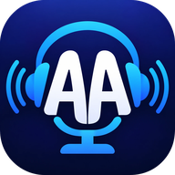

<p align="center">
  
</p>

# AA-AuralListen Podcatcher

Privater, werbefreier Podcatcher für Android – nur Audio, ohne Konto, ohne Tracking. Alle Daten bleiben auf dem
Gerät. Geschrieben in Flutter.

> **Sprache:** Die App ist momentan **nur auf Deutsch** verfügbar. Weitere Sprachen sollen demnächst folgen –
> alle Texte liegen bereits zentral in einer Übersetzungsdatei (`lib/l10n/app_de.arb`).

## Funktionen

**Podcasts finden und abonnieren**
- Suche über Apple Podcasts und fyyd.de, Abo per RSS-Adresse, OPML-Import und -Export (z. B. aus anderen Apps)
- Aktualisierung beim Start und per Herunterziehen; Umzüge von Podcasts (neue Feed-Adresse) werden übernommen
- Rote Zahl mit ungespielten Folgen an jedem Abo; Punkt bei frischen Folgen (letzte 96 Stunden)

**Hören**
- Wiedergabe im Hintergrund mit Benachrichtigung, Sperrbildschirm- und Bluetooth-Tasten
- Sprünge −15 s / +30 s, Lautstärke-Boost (global oder pro Podcast)
- Kapitel (Podlove, JSON, ID3) mit „Skip" je Kapitel, Lesezeichen mit Notiz
- Sleep-Timer: 5 / 15 / 30 / 60 Minuten, eigene Zeit oder bis Ende der Folge – mit sanftem Ausblenden
- Hörposition wird gemerkt; ab 98 % gilt eine Folge als gespielt
- Robust bei Netzproblemen: Hänger-Erkennung, Fortsetzen an der richtigen Stelle, klare Meldungen

**Playlists**
- Mehrere Playlists mit automatischem Weiterspielen; gespielte Folgen verlassen alle Playlists
- Sortieren nach Datum oder Namen, „Alles downloaden"
- Aus dem Abo-Menü: alle neuen, alle ungespielten oder alle ungespielten seit einem Datum in eine Playlist

**Downloads und Speicher**
- Downloads manuell oder automatisch pro Podcast (auch nur bestimmte Themen, z. B. bei Netzwerk-Feeds wie WRINT)
- Automatisches Löschen gespielter Folgen nach 96 Stunden, einstellbares Speicherlimit

**Sonstiges**
- „Als gespielt markieren bis …" / „Als ungespielt markieren seit …"
- Backup und Wiederherstellung (ZIP), Dark Mode

## Installation

Die App ist (noch) nicht im Play Store. Die signierte APK gibt es unter
[Releases](https://github.com/RainerWingel/AA-AuralListen-Podcatcher/releases):

1. Beim neuesten Release die Datei `…-arm64-v8a.apk` herunterladen (64-Bit-ARM, praktisch alle aktuellen
   Android-Handys).
2. Öffnen und installieren – Android fragt einmalig nach der Erlaubnis, Apps aus dieser Quelle zu installieren.
3. Empfehlung: In den App-Einstellungen unter **Akku → „Nicht eingeschränkt"** wählen (in der App: Optionen →
   Hören → „Hintergrund-Wiedergabe"), damit Android lange Wiedergaben mit ausgeschaltetem Bildschirm nicht beendet.

## Unterstützen

Wenn dir der AA-AuralListen Podcatcher gefällt und du die Entwicklung freiwillig unterstützen möchtest, kannst du mir
ein Trinkgeld über PayPal senden: **[paypal.me/Yama83](https://paypal.me/Yama83)**

## Datenschutz

Keine Konten, keine Werbung, kein Tracking, kein eigener Server. Details:
[Datenschutzerklärung](https://rainerwingel.github.io/AA-AuralListen-Podcatcher/datenschutz/).

## Selbst bauen

Voraussetzungen: Flutter 3.47.5 (Dart 3.13), Android SDK, Java 21.

```bash
flutter pub get
flutter analyze
flutter test
flutter build apk --release --split-per-abi
```

Die Release-Signatur kommt aus `android/key.properties` (nicht im Repo). Fehlt die Datei, wird mit dem
Debug-Schlüssel signiert – die APK läuft, lässt sich aber nicht als Update über die offiziellen Releases installieren.

## Projekt

- Plan und Fortschritt: [docs/roadmap.md](docs/roadmap.md)
- Funktionsumfang: [docs/features.md](docs/features.md)
- Architektur: [docs/architecture.md](docs/architecture.md)
- Hinweise für KI-Agenten (Claude, ChatGPT/Codex), die am Code arbeiten: [AGENTS.md](AGENTS.md)
